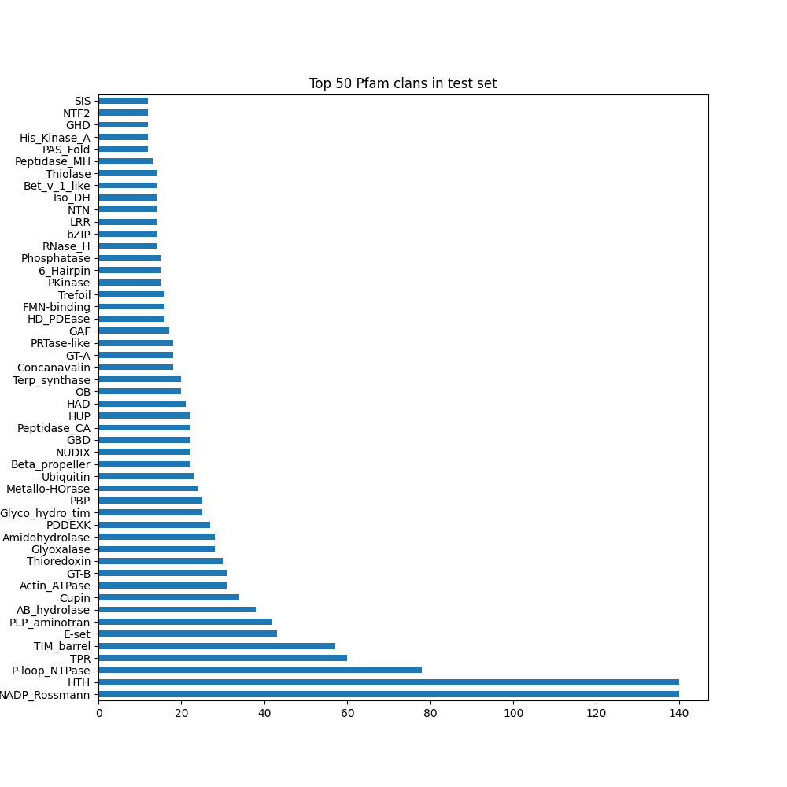

# Pinder 2024-02 release
- New dataset release version `2024-02`, with RCSB PDB entries ingested up until February 2024
- We’ve increased Foldseek’s sensitivity and now utilize LDDT (new) to better capture the alignment of flexible chains.
- We’ve added unit tests and QC reports that sanity check the splits using sequence alignments from MMseqs, domain annotations from ECOD, iAlign similary amongst other methods.
- Improved alignment sensitivity by optimizing Foldseek parameters
- We introduced an additional de-leaking step where we search for transitive neighbors in the interface alignment graph and use this to remove leakage across clusters
- With the re-run, we were able to increase the total dataset size, including newer RCSB entries that were not part of the previous ingest (this one goes up to Feb 2024)
- Most importantly, this increases `pinder-af2` holdout size from 69 before to 180 total now.
  - In addition to an overall larger size, we further improved the de-leaking process by scoring pairs of dimers with Foldseek or MMSeqs hits via iAlign to extract interface similarity.
  - The final `pinder-af2` set is comprised of systems that come from a PDB entry that was released after the AF2 training date (time split) and low or no interface similarity to AF2 training members.
  - There are 675 clusters in the time-split and 180 systems in the final iAlign-deleaked set.

## Updated dataset counts

| Dataset           |      Size |   PDB IDs |   Clusters |   Apo pairs |   AF2 Pairs |   Apo $\geq 1$ |   AF2 $\geq 1$ | Description                                                                                                                                                                                                                                   |
|:------------------|----------:|----------:|-----------:|------------:|------------:|---------------:|---------------:|:----------------------------------------------------------------------------------------------------------------------------------------------------------------------------------------------------------------------------------------------|
| `PINDER-XL`       |     1,955 |     1,955 |      1,955 |         342 |       1,747 |            436 |          1,775 | Full test set, 1,955 cluster representatives                                                                                                                                                                                                  |
| `PINDER-S`        |       250 |       250 |        250 |          93 |         250 |            143 |            250 | A smaller subset of PINDER-XL, comprised of 250 clusters (188 heterodimer and 62 homodimers) sampled for diverse Uniprot and PFAM annotations, with full AFDB coverage, to evaluate methods for which sampling from the full set is too slow  |
| `PINDER-AF2`      |       180 |       180 |        180 |          30 |         127 |             37 |            133 | A smaller subset of PINDER-XL, comprised of 180 clusters, 30 of which have paired apo structures and 131 with paired AFDB structures, which were deleaked against the AF2MM training set with a more rigorous deleaking process to remove any members with interfaces similar to the AF2MM training set as determined by iAlign, to evaluate methods against AF2MM                                                                                                 |
| `Val`             |     1,958 |     1,958 |      1,958 |         342 |       1,789 |            441 |          1,817 | Validation set, consisting of 1,958 cluster representatives                                                                                                                                                                                   |
| `Train`           | 1,560,682 |    62,706 |     42,220 |     136,498 |     566,171 |        274,194 |        621,276 | Training set, consisting of 1,560,682 dimers from 42,220 clusters                                                                                                                                                                             |


## Diversity stats

### Test + val size

* *Pinder cluster-level diversity: 12.41%*
* *Acceptance criteria: test + val > 5-10% of overall number of clusters*

### Interface size distribution

* Interface residue length distributions between splits
* Acceptance criteria: no specific criteria, we just want to ensure there is some overlap across splits


### Planarity distribution

* Planarity distribution between splits (lower means more transient interaction)
* Acceptance criteria: no specific criteria, we just want to ensure there is some overlap across splits


### ECOD domain-domain diversity
* ECOD domain is defined as
  (1) ECOD id which overlaps with the interface most
  (2) Minimum of 25% of interface & 10 AA should be covered
* "Pair diversity"
  * *test: 9.65%*
  * *val: 10.82%*
  * *test+val: 18.11%*
* *Acceptance criteria: >5%*

### Both chains unique ECOD domain (unique binding site ratio)
* Percentage of test systems with ECOD ids unique to test (both chains)
  * Check if single domain exists in train irrespective of pairs
  * If neither of the ECOD domains exist in train then this system is completely unique to the test
* test: 30.91%
* val: 33.15%
* Acceptance criteria: ~1/3rd

### ECOD single chain domain diversity
* ECOD domain diversity based on chains
* "Single-chain diversity"
  * *test: 18.47%*
  * *val: 21.14%*
  * *test+val: 33.83%*


### Pfam-clan distribution
* Pfam-clan level diversity (broader than ECOD families)
  * Note: not all chains are annotated
* *test: 52.65%*




## Leakage QC
### UniProt
* Intersection of uniprot pairs between train & test
  * *test: 3.17%*
  * *val: 3.63%*
* *Acceptance criteria: <5%*

### ECOD
* Percent of test set with same ECOD pair as train
  * *test: 6.39%*
  * *val: 8.02%*
* *Acceptance criteria: <10%*

### Sequence similarity (global)
* Test vs subsampled train (1 per cluster with clusters >20: 4,658 total systems)
  * 0.05% (2/3915) from sampling 0.24% of the training set (3627 entries).
  * subsampling 1.2% of the training set (a different set of 18,135 train systems) results in 0.07% leakage (3/3915)
* Acceptance criteria: N/A


## Parameter optimization

Foldseek and MMseqs2 alignments are used directly to de-leak, therefore looking at the leakage given these methods will yield no leakage unless the alignments produced are different from our pipeline. This could be because of bugs or inconsistencies between Foldseek/MMseqs2 runs. We performed Foldseek/MMseqs2 alignments between subsampled train data vs test and looked at the following:

1. Alignment consistency with same parameter settings
2. Alignment performance with different settings
   a. Tested Foldseek in slow-mode (performs tm-align at post instead of 3di)
   b. Tested different e-value cut-offs for both
   c. Higher "max n alignments per sequence" in MMseqs2
3. Test on single chain ECOD homology classification
   a. True alignment if both of the aligned chains have the same ECOD family.
   b. False if they have different ECOD family.

**Alignment consistency:**

* Foldseek alignments yielded ~90% (thr > 0.6) of overlap between the old and new alignments, both runs having similar total numbers above 0.6 lddt.
* MMseqs2 yielded substantially higher number of alignments. This was due to the lower number of sequences in the sequence subset used, which gave more freedom to the "max n alignments per sequence" parameter (1000). Therefore, most of these are suspected to be short and unspecific alignments at the used 30% ident. cutoff:


**Alignment at different settings:**

* The only setting with substantially different outcome was the use of "slow-mode" in Foldseek instead of "fast-mode" used in our pipeline (makes use of Foldseek alphabet + sequence similarity)
  * In general we see more alignments above the lddt threshold

**Assessment of differences in terms of performance:**

* MMseqs2 contribution is minimal (possibly random) with increased hits, confirming the hypothesis of short unspecific hits (FP)
  * default max hits:
    * TP: 1012 FP: 750
  * increased max hits:
    * TP: 1088 FP: 29560
* Foldseek fast-mode is better in terms of precision. This can be attributed to the VQ-VAE task used in Foldseek alphabet training which was based on SCOPe classification. This leads to good alignments for relevant folds and suboptimal alignments for "unimportant" folds which lead to low mean global lddt compared to tm-align pass.
  * fast-mode (alignment-type 2, 3Di+AA Gotoh-Smith-Waterman) at 0.5 lddt threshold:
    * TP: 2328 FP: 3586
  * slow-mode (alignment-type 1, TMalign) at 0.6 lddt threshold:
    * TP: 2200 FP: 3560


**Conclusion:**

* Our current settings for both Foldseek and MMseqs2 are good and no need to change anything.
* Alignment graph cutoff for Foldseek graph can be changed to 0.5 or 0.55 to cover more TPs, but may not make a substantial difference.


# Pinder 2023-11 (patch update)
- Previously, test set was defined by randomly sampling two accessions from each cluster
- This was done without redundancy removal, leading to redundant systems across pinder-xl, pinder-s and pinder-af2
- This update removes redundant test members as defined by having the same receptor and ligand UniProt IDs
- Representative was selected based on lowest number of interface atom gaps, highest sequence resolution, and crystal resolution (in that order)
- If both cluster members had identical characteristics, a representative was selected at random
- The structural files in the bucket remain unchanged; however, the index file was updated to remove the redundant rows.
  - **NOTE: In order to update to the new index file please remove the index.csv.gz from your `PINDER_BASE_DIR` env variable or default location in `~/.local/share/pinder`**
  - Alternatively, you can use the new CLI tool `pinder_update_index --help`


## Updated test dataset counts

| Dataset    | Monomer   |   Current count |   Previous count (with redundant test members) |
|:-----------|:----------|----------------:|-----------------------------------------------:|
| pinder_xl  | holo      |            1455 |                                           1756 |
| pinder_xl  | apo       |             323 |                                            401 |
| pinder_xl  | predicted |            1296 |                                           1575 |
| pinder_s   | holo      |             101 |                                            117 |
| pinder_s   | apo       |              59 |                                             71 |
| pinder_s   | predicted |              90 |                                            106 |
| pinder_af2 | holo      |              69 |                                             72 |
| pinder_af2 | apo       |              15 |                                             15 |
| pinder_af2 | predicted |              50 |                                             52 |


# Pinder 2023-11
- Initial release
- `PINDER_RELEASE=2023-11`

## Total dataset size
```
# compressed
34G     pdbs.zip
867M    csvs.zip

# unpacked
156G    pdbs
1.6G    csvs
```

## File manifest

```
gs://pinder/2023-11/index.csv.gz
gs://pinder/2023-11/metadata.csv.gz
gs://pinder/2023-11/csvs.zip
gs://pinder/2023-11/csvs/
gs://pinder/2023-11/pdbs.zip
gs://pinder/2023-11/pdbs/
```
