# Pinder abstractions

## PINDER system loader workflow: filters and transforms for Pinder dimer systems.

The loader workflow is aimed for ML or physics-based method applications.




## Filters

### PinderFilterBase

This is a base class for implementing additional sub-classes with implementations.

Each sub-class must implement a `filter` method, which accepts a `PinderSystem` as input, and return a boolean indicating whether the system passes the filter or not.

For example, if we wanted to limit pinder systems with holo monomers that are each at least 10 residues and at most 500 residues, we could construct a FilterByResidueCount like so:

```python
from pinder.core import PinderSystem
from pinder.core.loader import filters

class FilterByResidueCount(filters.PinderFilterBase):
    def __init__(self, **kwargs: int | None) -> None:
        self.query = filters.ResidueCount(**kwargs)

    def filter(self, ps: PinderSystem) -> bool:
        holo_structs = ["holo_receptor", "holo_ligand"]
        return all(
            self.query(getattr(ps, structure))
            for structure in holo_structs
        )

```

This filter is now callable and would return True or False depending on the criteria:

```python
>> pinder_id = "1df0__A1_Q07009--1df0__B1_Q64537"
>> ps = PinderSystem(pinder_id)

>> res_filter = FilterByResidueCount(min_residue_count=10, max_residue_count=500)
>> res_filter(ps)
False
```


### PinderFilterSubBase

This is a base class for implementing additional sub-classes with implementations.

Unlike `PinderFilterBase`, this class operates on individual monomers of the `PinderSystem` without filtering the entire set of dimers out of your training examples. These accept a `PinderSystem` as input, and return a `PinderSystem` as output.

For example, if we wanted to limit monomers to only those with a minimum number of atom types, we could implement a `AtomTypeCount` `ChainQuery`, and then use it in a `FilterMonomerAtomTypes` filter.

First create a `ChainQuery` which takes a [Structure](../src/pinder-core/pinder/core/loader/structure.py) object as input and returns a boolean value.

```python

class AtomTypeCount(filter.ChainQuery):
    def __init__(
        self,
        min_atom_type: int | None = None,
        max_atom_type: int | None = None,
        count_hetero: bool = False,
    ) -> None:
        self.min_atom_type = min_atom_type
        self.max_atom_type = max_atom_type
        self.count_hetero = count_hetero

    def check_length(self, chain: Structure) -> int:
        if self.count_hetero:
            return len(chain.atom_names)
        else:
            non_het = chain.filter("hetero", [False], copy=True)
            return len(non_het.atom_names)

    def query(self, chain: Structure) -> bool:
        n_at = self.check_length(chain)
        if self.min_atom_type is not None:
            if n_at < self.min_atom_type:
                return False
        if self.max_atom_type is not None:
            if n_at > self.max_atom_type:
                return False
        return True
```


The presence of individual monomer chains after applying a filter is still stored in the individual `PinderSystem` structure attributes.
If an individual monomer is removed by the filter, the corresponding structure attribute will be set to `None`, even if it was originally loaded as a `Structure` object.

Here's how to create a filter that would only keep monomers with at least 4 atom types (as default).

```python
class FilterMonomerAtomTypes(filters.PinderFilterSubBase):
    def __init__(self, min_atom_types: int = 4) -> None:
        super().__init__()
        self.min_atom_types = min_atom_types
        self.atom_type_count = AtomTypeCount(min_atom_type=min_atom_types)

    def filter(
        self, ps: PinderSystem, update_monomers: bool = True
    ) -> PinderSystem:
        return self.filter_by_chain_query(
            ps, self.atom_type_count, update_monomers=update_monomers
        )
```


### Filter implementation progress

- [x] Filter by sequence length
- [x] Filter by holo overlap
- [x] Number of atom types
- [x] Max. RMSD to holo
- [x] Backbone completeness
- [x] Minimum contact
- [x] Elongated chains
- [x] Discontinuous chains
- [x] Homodimer
- [x] Any metadata field


## Transforms

Transforms take a `PinderSystem` as input, apply structure transformations and return a `PinderSystem` as output.

The `PinderSystem` object exposes the set of `Structure` objects associated with a "system" (entry in the index).

The `Structure` objects expose a number of base methods which can be used to apply various transforms.

Some examples of transforms derived directly from `Structure` object:
```python

from pinder.core import PinderSystem
# Simplest interface - get a single pinder system
pinder_id = '1doa__A1_P60953--1doa__B1_P19803'
ps = PinderSystem(pinder_id)
holo_L_calpha = ps.holo_ligand.filter("atom_name", mask=["CA"])
# Can also filter "in place" rather than returning a copy
ps.apo_ligand.filter("atom_name", mask=["CA"], copy=False)

# You can superimpose `Structure` objects as long as they have common atoms:
# Calpha rmsd after superposition is stored in `rms`
R_super, rms = ps.apo_receptor.superimpose(ps.holo_receptor, copy=True)
L_super, rms = ps.apo_ligand.superimpose(ps.holo_ligand, copy=True)

```

To define a series of transforms in the loader, or implement custom transformation logic, you can create a subclass of the `TransformBase` parent class. The only requirement is that the subclass implements a `transform` method which accepts a `PinderSystem` as an input and returns a transformed `PinderSystem` as output.

Here's an example of a custom transform implementation that super-imposes all monomers to a reference monomer.

```python
from pinder.core.index.transforms import TransformBase


class SuperposeToReference(TransformBase):
    def __init__(self, reference_type: str = "holo") -> None:
        assert reference_type in {"holo", "native"}
        self.reference_type = reference_type

    def transform(self, ppi: PinderSystem) -> PinderSystem:
        assert ppi.holo_L and ppi.holo_R
        if self.reference_type == "native":
            ppi.holo_receptor = ppi.aligned_holo_R
            ppi.holo_ligand = ppi.aligned_holo_L

        R_ref = ppi.holo_receptor
        L_ref = ppi.holo_ligand
        for R_monomer in ["apo_receptor", "pred_receptor"]:
            R_struc = getattr(ppi, R_monomer)
            if R_struc:
                unbound_super, rms_R = R_struc.superimpose(R_ref)
                setattr(ppi, R_monomer, unbound_super)

        for L_monomer in ["apo_ligand", "pred_ligand"]:
            L_struc = getattr(ppi, L_monomer)
            if L_struc:
                unbound_super, rms_L = L_struc.superimpose(L_ref)
                setattr(ppi, L_monomer, unbound_super)
        return ppi

```


### Structure object
```python

# You can add `Structure` objects to create a multimer complex using Structure.__add__
apo_binary = R_super + L_super
holo_binary = ps.holo_receptor + ps.holo_ligand
ps.apo_ligand.resolved_pdb2uniprot
apo_complex.resolved_mapping
ps.apo_ligand.coords[0:10]
ps.apo_ligand.residue_names
ps.apo_ligand.sequence
ps.apo_ligand.chain_sequence
apo_complex.chain_sequence

# The underlying [biotite](https://www.biotite-python.org/) AtomArray object:
ps.apo_ligand.atom_array[0:10]
ps.apo_ligand.atom_array.res_name
ps.apo_ligand.atom_array[apo_L.backbone_mask][0:10]
ps.apo_ligand.atom_array[apo_L.calpha_mask][0:10]

# If the output PDB filepath is omitted, the structure will be written to Structure.filepath, which may overwrite

# In this case, it would be a new file composed of the added complex filepaths if we omit
apo_complex.to_pdb(destination_dir / "apo_complex.pdb")
```


## Writers/Generators

Writers take `Iterator` of `PinderSystem` as input, apply user defined featurization, write as pickled input features or iterator of features.

## Pinder loader

Pinder loader brings together filters, transforms and writers to create an optionally parallel `PinderSystem` iterator. Takes either split or list of systems as input.

```python

from pinder.core import PinderLoader
from pinder.core.loader import filters
from pinder.core.loader.writer import PinderDefaultWriter

base_filters = [
    filters.FilterByMissingHolo(),
    filters.FilterSubByContacts(min_contacts=5, radius=10.0, calpha_only=True),
    filters.FilterByHoloElongation(max_var_contribution=0.92),
    filters.FilterDetachedHolo(radius=12, max_components=2),
]
sub_filters = [
    filters.FilterSubByAtomTypes(min_atom_types=4),
    filters.FilterByHoloOverlap(min_overlap=5),
    filters.FilterByHoloSeqIdentity(min_sequence_identity=0.8),
    filters.FilterSubLengths(min_length=0, max_length=1000),
    filters.FilterSubRmsds(rmsd_cutoff=7.5),
    filters.FilterByElongation(max_var_contribution=0.92),
    filters.FilterDetachedSub(radius=12, max_components=2),
]
loader = PinderLoader(
    base_filters = base_filters,
    sub_filters = sub_filters
)
loader.load_split("train")
loader.load_split("test", "pinder_af2")
loader.load_systems([pinder_id])

passing_ids = []
for dimer in loader.dimers:
    print(dimer.entry.id)
    passing_ids.append(dimer.entry.id)

systems_removed_by_filters = set(systems) - set(passing_ids)

# If you want to explicitly write (potentially transformed) PDB files to a custom location:
loader = PinderLoader(
    base_filters=base_filters,
    sub_filters=sub_filters,
    writer=PinderDefaultWriter(pinder_temp_dir)
)
loader.load_systems([pinder_id])
loaded = loader.load(n_cpu=1, batch_size=1)
assert loader.writer.output_path.is_dir()
assert len(list(loader.writer.output_path.glob("af_*.pdb"))) == 2

```

## Create test dataset
```python
from pinder.core import get_index, PinderSystem
from pinder.core.loader.geodata import PairedPDB, NodeRepresentation
from pinder.core.loader.dataset import get_geo_loader, PPIDataset
from torch_geometric.data import HeteroData
from torch_geometric.loader import DataLoader


nodes = {NodeRepresentation("atom"), NodeRepresentation("residue")}
train_dataset = PPIDataset(
    node_types=nodes,
    split="train",
    monomer1="holo_receptor",
    monomer2="holo_ligand",
    limit_by=5,
)
assert len(train_dataset) == 5

pindex = get_index()
raw_ids = set(train_dataset.raw_file_names)
processed_ids = {f.stem for f in train_dataset.processed_file_names}

data_item = train_dataset[0]
assert isinstance(data_item, HeteroData)

data_item = train_dataset.get_filename("117e__A1_P00817--117e__B1_P00817")
assert data_item.num_nodes == 5031
assert data_item.num_edges == 0
assert isinstance(data_item.num_node_features, dict)
expected_num_feats = {
    'ligand_residue': 0,
    'receptor_residue': 0,
    'ligand_atom': 12,
    'receptor_atom': 12,
    'pdb': 0,
}
for k, v in expected_num_feats.items():
    assert data_item.num_node_features[k] == v

expected_node_types = [
    'ligand_residue', 'receptor_residue', 'ligand_atom', 'receptor_atom', 'pdb'
]
assert data_item.node_types == expected_node_types

train_dataset.print_summary()

loader = get_geo_loader(train_dataset)

assert isinstance(loader, DataLoader)
assert hasattr(loader, "dataset")
ds = loader.dataset
assert len(ds) == 5

```
